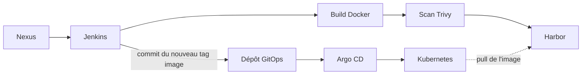
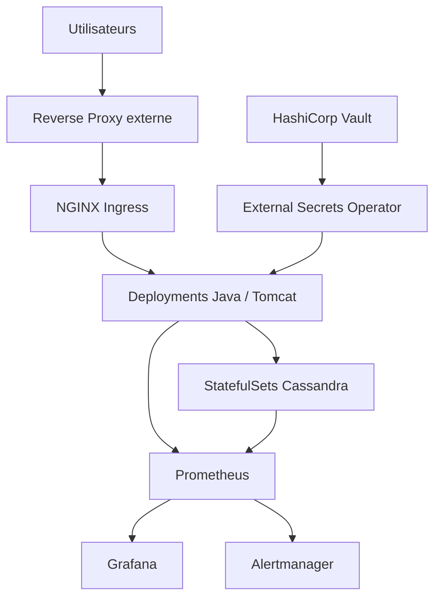

🌐 **Langue :** [English](README.md) | **Français**

# Migration Kubernetes & GitOps — Étude de cas anonymisée

> **Note de confidentialité**
>
> Ce dépôt présente une étude de cas technique anonymisée issue d’un projet d’ingénierie réalisé en environnement professionnel. Il n’inclut volontairement aucun code propriétaire, nom d’entreprise, nom de produit, identifiant, URL interne, adresse IP, capture d’écran, schéma de base de données, configuration privée ni manifeste réutilisable appartenant à l’entreprise.

## Vue d’ensemble

Cette étude de cas présente la modernisation d’une plateforme d’entreprise historique initialement déployée sur plusieurs machines virtuelles Linux.

La plateforme cible a introduit :

- la conteneurisation avec Docker
- Kubernetes installé avec kubeadm
- des charts Helm personnalisés
- Jenkins pour la CI
- Trivy pour l’analyse des images
- Harbor comme registre privé de conteneurs
- Argo CD pour le déploiement GitOps
- HashiCorp Vault et External Secrets Operator
- Calico et les NetworkPolicies
- Prometheus, Grafana et Alertmanager
- NGINX Ingress
- Horizontal Pod Autoscaler
- des sondes Startup, Readiness et Liveness
- une topologie Cassandra stateful

L’objectif n’était pas simplement de déplacer les workloads dans des conteneurs, mais de repenser le déploiement et l’exploitation afin de les rendre plus **reproductibles, observables, scalables, sécurisés et résilients**.

## De l’architecture legacy aux opérations Cloud Native

### Environnement initial

La plateforme reposait sur :

- plusieurs machines virtuelles Linux
- des applications Java/Spring hébergées sur Tomcat
- un cluster Cassandra distribué
- des configurations gérées au niveau des serveurs
- des déploiements applicatifs manuels
- une initialisation Cassandra manuelle
- des opérations de scaling et de reprise principalement manuelles
- une observabilité limitée

### Plateforme cible

La modernisation a introduit des workloads déclaratifs, une chaîne de livraison automatisée, une gestion centralisée des secrets, une meilleure isolation réseau, une supervision proactive et des mécanismes natifs de récupération Kubernetes.

## Vue de l’architecture

### 1. Livraison & GitOps



Le pipeline CI publie l’image validée dans Harbor puis met à jour son tag dans le dépôt GitOps. Argo CD détecte le changement Git et synchronise Kubernetes. Le cluster récupère ensuite l’image référencée depuis Harbor.

### 2. Plateforme d’exécution



Cette vue se concentre sur l’exécution : trafic applicatif, couche de données, secrets et observabilité.

## Environnement de validation Kubernetes

L’environnement de validation documenté utilisait :

- **1 Control Plane**
- **3 nœuds Worker**
- **Ubuntu Server 22.04 LTS**
- **Kubernetes v1.33**
- **kubeadm**
- **Calico CNI**

Chaque machine virtuelle disposait de **3 vCPU et 6 Go de RAM**.

## Principaux axes d’ingénierie

### Cassandra sur Kubernetes

Un chart Helm personnalisé a été développé afin de modéliser dynamiquement la topologie Cassandra.

Les éléments principaux comprenaient :

- un StatefulSet par Data Center logique
- une identité stable pour les pods
- des Headless Services pour la découverte Cassandra
- du stockage persistant via les volume claim templates
- Node Affinity et Pod Anti-Affinity
- un bootstrap automatisé après le déploiement

Le bootstrap automatisait notamment l’initialisation du schéma, le chargement des données initiales et la création des utilisateurs applicatifs.

### Couche applicative

Les workloads Java/Tomcat étaient déployés sous forme de Deployments Kubernetes.

La couche applicative utilisait :

- des ConfigMaps pour externaliser la configuration
- des Services ClusterIP
- NGINX Ingress
- un reverse proxy externe en amont de l’Ingress Controller
- plusieurs réplicas
- des sondes Startup, Readiness et Liveness
- un HPA basé sur les métriques CPU et mémoire

### CI/CD & GitOps

Le flux mis en œuvre était :

```text
Nexus
  ↓
Jenkins
  ↓
Build Docker
  ↓
Scan Trivy
  ↓
Harbor
  ↓
Jenkins met à jour le tag image dans le dépôt GitOps
  ↓
Argo CD
  ↓
Kubernetes récupère l'image référencée depuis Harbor
```

Après la publication d’une image validée dans Harbor, Jenkins mettait automatiquement à jour sa référence dans le dépôt GitOps. Argo CD détectait ensuite la modification et synchronisait le cluster.

> **Note d’implémentation :** cette écriture automatique de Jenkins vers Git correspondait au workflow du projet/lab. En production, une organisation peut préférer des contrôles de promotion plus stricts : approbation par pull request, image digest, gates ou outils dédiés d’automatisation d’images.

### Sécurité

La conception de sécurité comprenait :

- analyse des images avec Trivy
- Harbor pour la distribution contrôlée des images
- HashiCorp Vault déployé hors du cluster Kubernetes
- External Secrets Operator
- RBAC
- Service Accounts dédiés
- NetworkPolicies Calico
- principe du moindre privilège

### Observabilité

L’architecture de supervision comprenait :

- Prometheus
- Grafana
- Alertmanager
- Node Exporter
- kube-state-metrics
- cAdvisor
- Cassandra Exporter
- JMX Exporter pour les métriques Java/Tomcat

Cette architecture offrait une visibilité sur l’infrastructure, les ressources Kubernetes, Cassandra ainsi que le comportement applicatif/JVM.

## Stack technique

| Domaine | Technologies |
|---|---|
| Conteneurs | Docker |
| Orchestration | Kubernetes, kubeadm |
| Packaging | Helm |
| Réseau | Calico, Kubernetes Services, NGINX Ingress |
| CI | Jenkins |
| Dépôt d’artefacts | Nexus |
| Registre | Harbor |
| GitOps | Argo CD |
| Sécurité | Trivy, HashiCorp Vault, External Secrets Operator, RBAC, NetworkPolicies |
| Observabilité | Prometheus, Grafana, Alertmanager, Node Exporter, kube-state-metrics, cAdvisor |
| Monitoring applicatif | JMX Exporter |
| Monitoring base de données | Cassandra Exporter |
| Applications | Java, Spring, Tomcat |
| Base de données | Apache Cassandra |
| OS | Ubuntu Server / Linux |

## Structure du dépôt

```text
kubernetes-gitops-case-study/
├── README.md
├── README.fr.md
├── docs/
│   ├── architecture.md
│   ├── cassandra.md
│   ├── gitops-ci-cd.md
│   ├── observability.md
│   ├── security.md
│   ├── scalability-ha.md
│   ├── challenges-lessons.md
│   └── fr/
│       └── ...
└── diagrams/
    ├── high-level-architecture.md
    ├── cicd-gitops-flow.md
    ├── observability-flow.md
    └── fr/
        └── ...
```

Ce dépôt contient **uniquement de la documentation**. Il ne contient aucun code source appartenant à l’entreprise, manifeste de production ni configuration confidentielle.

## Résultats

L’approche de migration a amélioré :

- la reproductibilité des déploiements
- la cohérence des configurations
- la traçabilité via Git
- la capacité de scaling horizontal
- la récupération automatique des workloads
- la gestion des secrets
- l’isolation réseau
- l’observabilité
- la maintenabilité opérationnelle

## Documentation

- [Architecture](docs/fr/architecture.md)
- [Cassandra sur Kubernetes](docs/fr/cassandra.md)
- [CI/CD & GitOps](docs/fr/gitops-ci-cd.md)
- [Observabilité](docs/fr/observability.md)
- [Sécurité](docs/fr/security.md)
- [Scalabilité & Haute Disponibilité](docs/fr/scalability-ha.md)
- [Défis & Retours d’expérience](docs/fr/challenges-lessons.md)

## Diagrammes

- [Vue d’architecture](diagrams/fr/high-level-architecture.md)
- [Flux CI/CD & GitOps](diagrams/fr/cicd-gitops-flow.md)
- [Flux d’observabilité](diagrams/fr/observability-flow.md)
