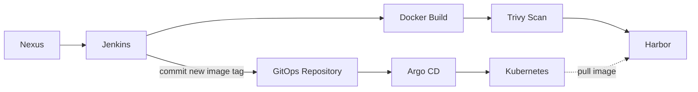
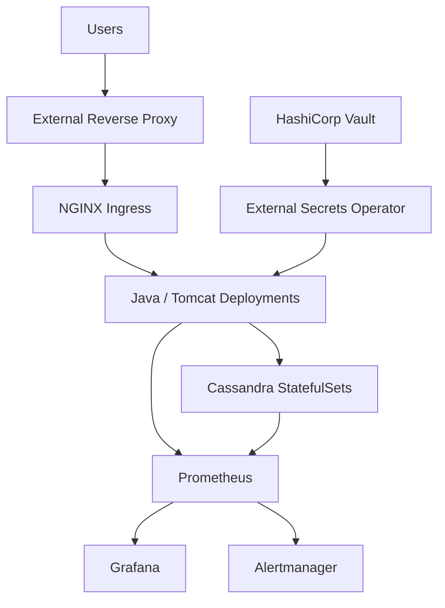

🌐 **Language:** **English** | [Français](README.fr.md)

# Kubernetes & GitOps Migration — Sanitized Case Study

> **Confidentiality note**
>
> This repository is a sanitized technical case study based on professional engineering work. It intentionally excludes proprietary source code, company names, product names, credentials, internal URLs, IP addresses, screenshots, database schemas, private configuration, and reusable company-specific manifests.

## Overview

This case study documents the modernization of a legacy enterprise platform originally deployed on Linux virtual machines.

The target platform introduced:

- Docker containerization
- Kubernetes installed with kubeadm
- custom Helm charts
- Jenkins CI
- Trivy image scanning
- Harbor as the private container registry
- Argo CD for GitOps-based deployment
- HashiCorp Vault and External Secrets Operator
- Calico networking and NetworkPolicies
- Prometheus, Grafana and Alertmanager
- NGINX Ingress
- Horizontal Pod Autoscaling
- Startup, Readiness and Liveness probes
- a stateful Cassandra topology

The objective was not simply to move workloads into containers, but to redesign deployment and operations so they became more **repeatable, observable, scalable, secure and resilient**.

## From Legacy to Cloud-Native Operations

### Legacy Environment

The starting platform relied on:

- multiple Linux virtual machines
- Java/Spring applications hosted on Tomcat
- a distributed Cassandra cluster
- host-level configuration
- manual application deployment
- manual Cassandra initialization
- manual scaling and recovery operations
- limited observability

### Target Platform

The modernization introduced declarative workloads, automated delivery, centralized secrets, stronger network isolation, proactive monitoring and Kubernetes-native recovery mechanisms.

## Architecture Overview

### 1. Delivery & GitOps



The CI pipeline publishes the validated image to Harbor and updates the image tag in the GitOps repository. Argo CD detects the Git change and synchronizes Kubernetes. Kubernetes then pulls the referenced image from Harbor.

### 2. Runtime Platform



This second view focuses only on the runtime platform: application traffic, data, secrets and observability.

## Kubernetes Validation Environment

The documented validation environment used:

- **1 Control Plane**
- **3 Worker nodes**
- **Ubuntu Server 22.04 LTS**
- **Kubernetes v1.33**
- **kubeadm**
- **Calico CNI**

Each virtual machine was provisioned with **3 vCPU and 6 GB RAM**.

## Main Engineering Areas

### Cassandra on Kubernetes

A custom Helm chart was developed to model Cassandra dynamically.

Key design elements included:

- one StatefulSet per logical Data Center
- stable pod identity
- Headless Services for Cassandra discovery
- persistent storage through volume claim templates
- Node Affinity and Pod Anti-Affinity
- automated bootstrap after deployment

The bootstrap process automated schema initialization, initial data loading and application-user creation.

### Application Layer

Java/Tomcat workloads were deployed as Kubernetes Deployments.

The application layer used:

- ConfigMaps for externalized configuration
- ClusterIP Services
- NGINX Ingress
- an external reverse proxy upstream of the Ingress Controller
- multiple replicas
- Startup, Readiness and Liveness probes
- HPA based on CPU and memory signals

### CI/CD & GitOps

The implemented project flow was:

```text
Nexus
  ↓
Jenkins
  ↓
Docker Build
  ↓
Trivy Scan
  ↓
Harbor
  ↓
Jenkins updates the image tag in the GitOps repository
  ↓
Argo CD
  ↓
Kubernetes pulls the referenced image from Harbor
```

After a validated image was pushed to Harbor, Jenkins automatically updated the image reference in the GitOps repository. Argo CD then detected the Git change and synchronized the cluster.

> **Implementation note:** this automated Git write-back reflected the project/lab workflow. In production environments, organizations may prefer stricter promotion controls, pull-request approval, image-digest pinning or dedicated image-automation tooling.

### Security

The security design included:

- Trivy image scanning
- Harbor for controlled image distribution
- HashiCorp Vault outside the Kubernetes cluster
- External Secrets Operator
- RBAC
- dedicated Service Accounts
- Calico NetworkPolicies
- least-privilege access design

### Observability

The monitoring architecture included:

- Prometheus
- Grafana
- Alertmanager
- Node Exporter
- kube-state-metrics
- cAdvisor
- Cassandra Exporter
- JMX Exporter for Java/Tomcat metrics

This provided visibility across infrastructure, Kubernetes resources, Cassandra and application/JVM behavior.

## Technology Stack

| Area | Technologies |
|---|---|
| Containers | Docker |
| Orchestration | Kubernetes, kubeadm |
| Packaging | Helm |
| Networking | Calico, Kubernetes Services, NGINX Ingress |
| CI | Jenkins |
| Artifact Repository | Nexus |
| Registry | Harbor |
| GitOps | Argo CD |
| Security | Trivy, HashiCorp Vault, External Secrets Operator, RBAC, NetworkPolicies |
| Observability | Prometheus, Grafana, Alertmanager, Node Exporter, kube-state-metrics, cAdvisor |
| Application Monitoring | JMX Exporter |
| Database Monitoring | Cassandra Exporter |
| Applications | Java, Spring, Tomcat |
| Database | Apache Cassandra |
| OS | Ubuntu Server / Linux |

## Repository Structure

```text
kubernetes-gitops-case-study/
├── README.md
├── docs/
│   ├── architecture.md
│   ├── cassandra.md
│   ├── gitops-ci-cd.md
│   ├── observability.md
│   ├── security.md
│   ├── scalability-ha.md
│   └── challenges-lessons.md
└── diagrams/
    ├── high-level-architecture.md
    ├── cicd-gitops-flow.md
    └── observability-flow.md
```

The repository contains **documentation only**. It does not contain company-owned source code, production manifests or confidential configuration.

## Outcomes

The migration approach improved:

- deployment repeatability
- configuration consistency
- Git-based traceability
- horizontal scaling capability
- automatic workload recovery
- secrets handling
- network isolation
- observability
- operational maintainability

## Documentation

- [Architecture](docs/architecture.md)
- [Cassandra on Kubernetes](docs/cassandra.md)
- [CI/CD & GitOps](docs/gitops-ci-cd.md)
- [Observability](docs/observability.md)
- [Security](docs/security.md)
- [Scalability & High Availability](docs/scalability-ha.md)
- [Challenges & Lessons Learned](docs/challenges-lessons.md)

## Diagrams

- [High-Level Architecture](diagrams/high-level-architecture.md)
- [CI/CD & GitOps Flow](diagrams/cicd-gitops-flow.md)
- [Observability Flow](diagrams/observability-flow.md)
