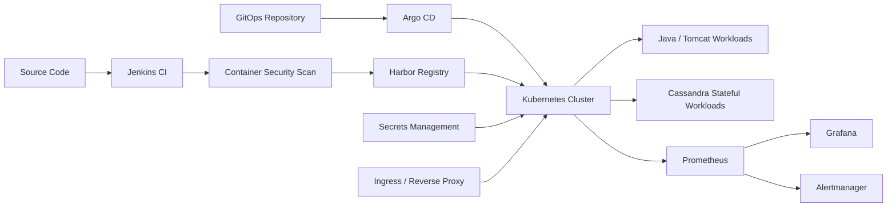

# Kubernetes & GitOps Migration — Sanitized Case Study

> **Confidentiality note**
>
> This repository is a sanitized technical case study based on professional engineering work. It intentionally excludes proprietary source code, company names, product names, credentials, internal URLs, IP addresses, screenshots, database schemas, private configuration, and reusable company-specific manifests.

## Overview

This case study documents the migration of a legacy enterprise application platform from traditional Linux virtual machines to a Kubernetes-based delivery model.

The project focused on modernizing deployment and operations through:

- containerization
- Kubernetes orchestration
- Helm packaging
- GitOps with Argo CD
- CI with Jenkins
- private image distribution through Harbor with Harbor
- security scanning
- secrets management
- observability with Prometheus, Grafana and Alertmanager
- health probes and autoscaling
- stronger operational repeatability

The goal was not simply to "move workloads to Kubernetes", but to redesign the deployment process so that infrastructure and application delivery became more **repeatable, observable, scalable and controlled**.

## Initial Situation

The legacy platform relied on:

- Linux virtual machines
- Java applications hosted on Tomcat
- a distributed Cassandra database
- manual or semi-manual deployment procedures
- infrastructure-specific configuration
- limited standardization between environments

This created operational challenges around deployment consistency, scaling, service recovery, configuration management and observability.

## Target Architecture



## Main Engineering Areas

### Kubernetes Platform

The application architecture was adapted to Kubernetes using appropriate workload, networking, configuration and storage primitives.

Key concerns included:

- stateless and stateful workloads
- service discovery
- persistent storage
- ingress
- configuration separation
- health checks
- resource requests and limits
- controlled scheduling and scaling

### CI/CD & GitOps

The delivery workflow separated **image creation** from **deployment state**.

The CI pipeline was responsible for:

1. building application images
2. scanning images for vulnerabilities
3. publishing approved images to Harbor

GitOps was then used for deployment:

1. desired deployment state was stored in Git
2. Argo CD continuously compared Git with the cluster
3. approved changes were synchronized to Kubernetes
4. drift became visible and deployments became auditable

### Security

Security controls included:

- private image distribution
- vulnerability scanning
- externalized secrets management
- workload identity and access controls
- network isolation
- non-root container practices
- separation between application configuration and secrets

### Observability

The monitoring stack used:

- Prometheus
- Grafana
- Alertmanager
- infrastructure exporters
- JVM/application metrics
- Kubernetes workload metrics

This enabled visibility across both platform health and application behavior.

### Reliability & Scaling

The platform design introduced:

- readiness probes
- liveness probes
- startup probes
- horizontal autoscaling
- replicated stateless workloads
- stateful workload orchestration
- declarative recovery behavior

## Technology Stack

| Area | Technologies |
|---|---|
| Containers | Docker |
| Orchestration | Kubernetes |
| Packaging | Helm |
| GitOps | Argo CD |
| CI | Jenkins |
| Registry | Harbor |
| Security | Trivy, HashiCorp Vault |
| Observability | Prometheus, Grafana, Alertmanager |
| Networking | Kubernetes Services, Ingress, reverse proxy |
| Applications | Java, Tomcat |
| Database | Cassandra |
| OS | Linux |

## What This Repository Contains

```text
kubernetes-gitops-case-study/
├── README.md
├── docs/
│   ├── architecture.md
│   ├── gitops-ci-cd.md
│   ├── observability.md
│   ├── security.md
│   ├── scalability-ha.md
│   └── challenges-lessons.md
└── diagrams/
    └── README.md
```

The repository contains **documentation only**. It does not contain production manifests or company-owned code.

## Key Outcomes

The migration approach improved:

- deployment repeatability
- configuration consistency
- release traceability
- operational visibility
- workload recovery
- horizontal scaling capability
- separation of build and deployment responsibilities
- security controls around images and secrets

## Why This Case Study Is Public

The purpose of this repository is to demonstrate the engineering reasoning behind a real Kubernetes and GitOps migration while respecting confidentiality.

It focuses on:

- architecture
- technical decisions
- operational trade-offs
- platform engineering practices
- lessons learned

rather than exposing implementation artifacts owned by a company.

## Documentation

- [Architecture](docs/architecture.md)
- [CI/CD & GitOps](docs/gitops-ci-cd.md)
- [Observability](docs/observability.md)
- [Security](docs/security.md)
- [Scalability & High Availability](docs/scalability-ha.md)
- [Challenges & Lessons Learned](docs/challenges-lessons.md)
