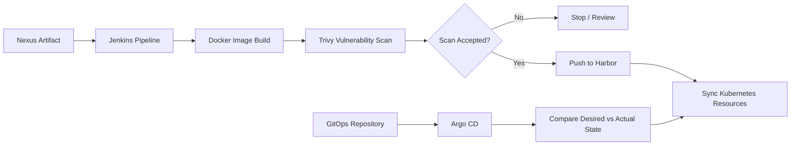

# CI/CD & GitOps Flow

## Separation of Responsibilities

The flow deliberately separates:

**CI**
- retrieve artifact
- build image
- scan image
- publish image

from:

**GitOps/CD**
- store desired deployment state in Git
- detect drift
- synchronize approved state with Kubernetes

This separation improves traceability and reduces hidden manual changes.
