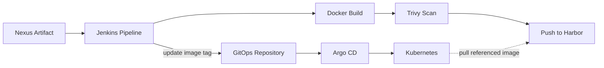

🌐 **Language:** **English** | [Français](fr/cicd-gitops-flow.md)

# CI/CD & GitOps Flow

## What Happens

1. Jenkins retrieves the application artifact from Nexus.
2. Jenkins builds the container image.
3. Trivy scans the image.
4. Jenkins pushes the validated image to Harbor.
5. Jenkins automatically commits the new image tag to the GitOps repository.
6. Argo CD detects the Git change.
7. Argo CD synchronizes the Kubernetes resources.
8. Kubernetes pulls the referenced image from Harbor.

## Responsibility of Each Component

| Component | Responsibility |
|---|---|
| Nexus | Stores application artifacts |
| Jenkins | Orchestrates CI and updates the GitOps image tag |
| Docker | Builds the container image |
| Trivy | Scans the image for vulnerabilities |
| Harbor | Stores the validated container image |
| GitOps Repository | Stores the desired deployment state |
| Argo CD | Reconciles Git state with Kubernetes |
| Kubernetes | Runs the workloads and pulls images from Harbor |

## Production Consideration

The automatic Jenkins write-back to Git reflected the project workflow.

A production environment may introduce additional controls such as pull-request approval, image digests, promotion gates or dedicated image-automation tooling.
