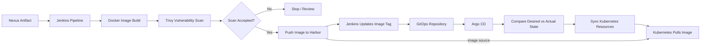

# CI/CD & GitOps Flow

## Implemented Project Flow

The CI pipeline performed:

- artifact retrieval from Nexus
- image build
- vulnerability scanning
- image publication to Harbor
- automatic update of the image tag in the GitOps repository

Argo CD then detected the Git change and synchronized the desired state with Kubernetes.

Kubernetes did not receive an image directly from Jenkins or Argo CD. The deployment referenced the Harbor image, and the cluster pulled that image at runtime.

## Production Consideration

The automatic Jenkins commit to the GitOps repository was part of the project workflow.

In a stricter production setup, the promotion step could instead use controls such as:

- pull requests and approval
- image digests
- environment promotion
- dedicated image-automation tooling
- signed images and policy checks
