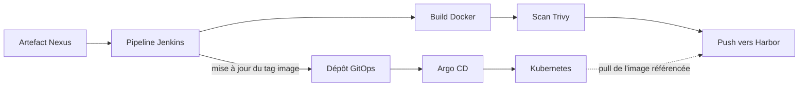

🌐 **Langue :** [English](../cicd-gitops-flow.md) | **Français**

# Flux CI/CD & GitOps

## Déroulement

1. Jenkins récupère l’artefact depuis Nexus.
2. Jenkins construit l’image.
3. Trivy analyse l’image.
4. Jenkins publie l’image validée dans Harbor.
5. Jenkins commit automatiquement le nouveau tag image dans le dépôt GitOps.
6. Argo CD détecte le changement Git.
7. Argo CD synchronise Kubernetes.
8. Kubernetes récupère l’image référencée depuis Harbor.
