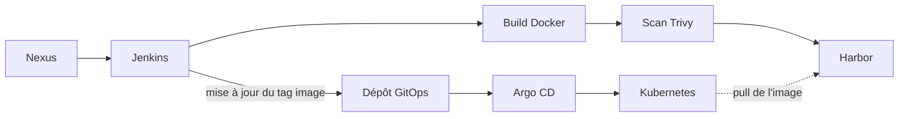
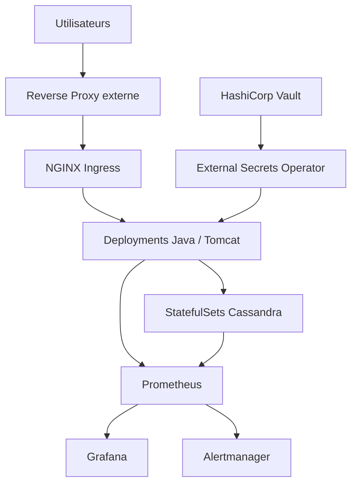

🌐 **Langue :** [English](../high-level-architecture.md) | **Français**

# Vue d’architecture

L’architecture est volontairement séparée en deux vues afin d’éviter un diagramme trop chargé.

## 1. Livraison & GitOps

## 2. Plateforme d’exécution

Les diagrammes restent volontairement génériques et excluent les identifiants spécifiques à l’entreprise.
