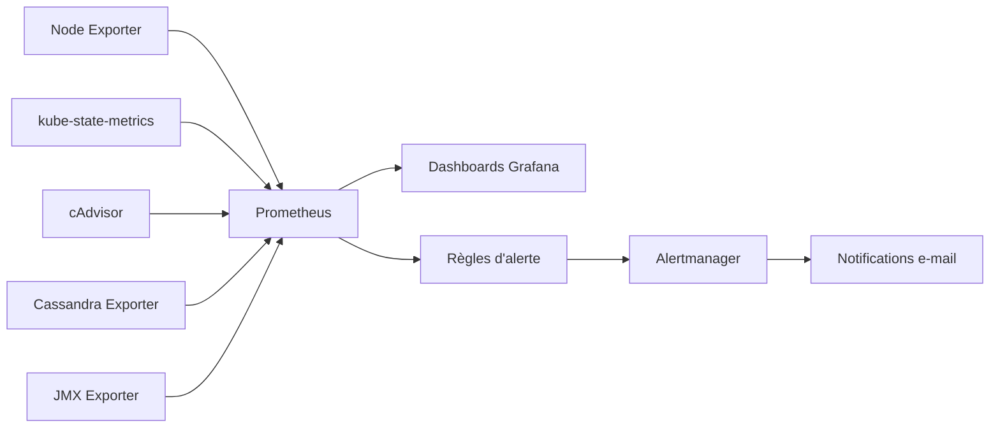

🌐 **Langue :** [English](../observability-flow.md) | **Français**

# Flux d’observabilité

## Couverture

L’architecture collectait :

- les métriques des hôtes
- l’état des objets Kubernetes
- les métriques des conteneurs
- les métriques Cassandra
- les métriques JVM/applicatives

Prometheus centralisait la collecte et l’évaluation des alertes, Grafana assurait la visualisation et Alertmanager distribuait les alertes.
