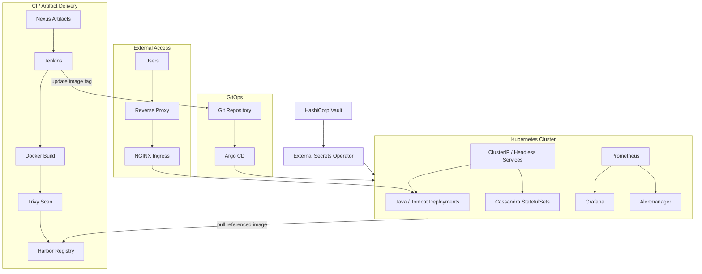

# High-Level Architecture

## What the Diagram Shows

The project workflow separates:

- artifact retrieval and image build
- security scanning and image publication
- GitOps state management
- cluster reconciliation
- runtime image pulling

After pushing an image to Harbor, Jenkins automatically updated the image tag in the GitOps repository. Argo CD detected that Git change and synchronized Kubernetes, which then pulled the referenced image from Harbor.

The diagram is intentionally generic and excludes company-specific identifiers.
