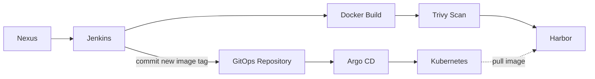
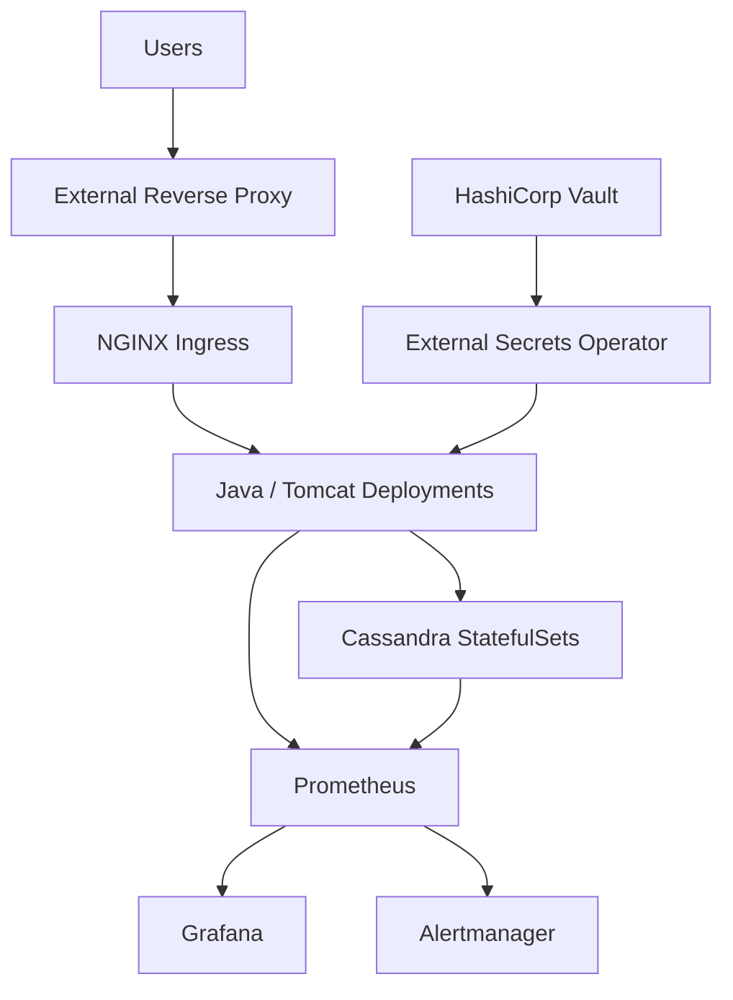

🌐 **Language:** **English** | [Français](fr/high-level-architecture.md)

# Architecture Overview

Instead of placing every component into one large graph, the architecture is split into two views.

## 1. Delivery & GitOps

### Flow

1. Jenkins retrieves the application artifact from Nexus.
2. Jenkins builds the Docker image.
3. Trivy scans the image.
4. The validated image is pushed to Harbor.
5. Jenkins updates the image tag in the GitOps repository.
6. Argo CD detects the Git change.
7. Argo CD synchronizes Kubernetes.
8. Kubernetes pulls the referenced image from Harbor.

## 2. Runtime Platform

### Runtime Responsibilities

- **Reverse Proxy + NGINX Ingress** — external application access
- **Tomcat Deployments** — application workloads
- **Cassandra StatefulSets** — stateful data layer
- **Vault + External Secrets Operator** — secret delivery
- **Prometheus + Grafana + Alertmanager** — metrics, dashboards and alerting

The diagrams are intentionally generic and exclude company-specific identifiers.
