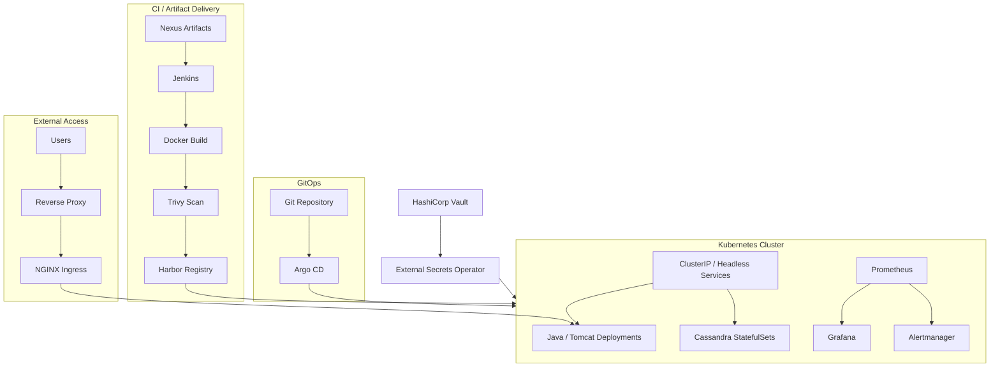

# High-Level Architecture

## What the Diagram Shows

The architecture separates four responsibilities:

- artifact and image delivery
- GitOps reconciliation
- application/data workloads
- security and observability

The diagram is intentionally generic and excludes company-specific identifiers.
