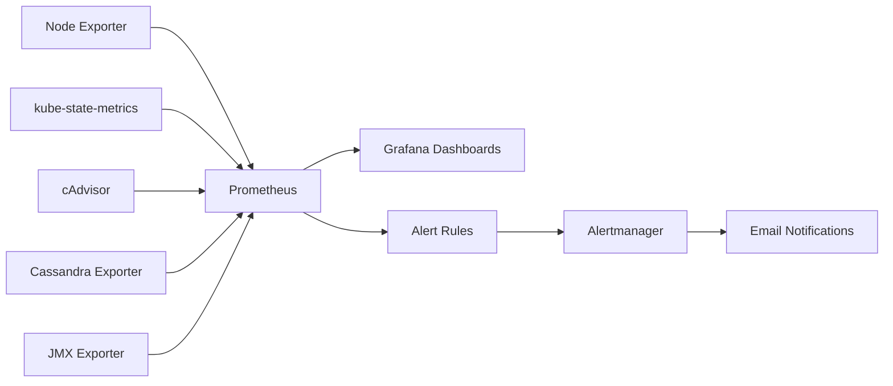

🌐 **Language:** **English** | [Français](fr/observability-flow.md)

# Observability Flow

## Coverage

The monitoring architecture collected:

- host metrics
- Kubernetes object state
- container metrics
- Cassandra metrics
- JVM/application metrics

Prometheus centralized collection and alert evaluation, Grafana handled visualization, and Alertmanager handled alert distribution.
